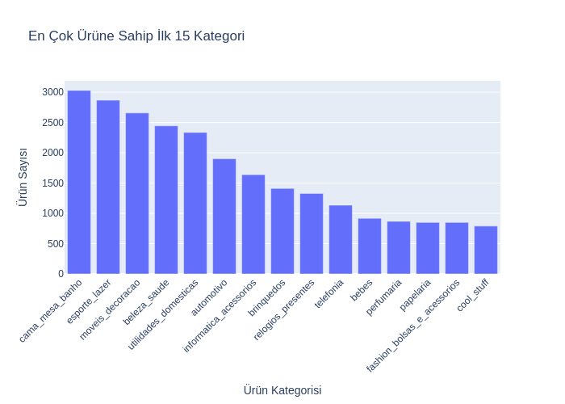
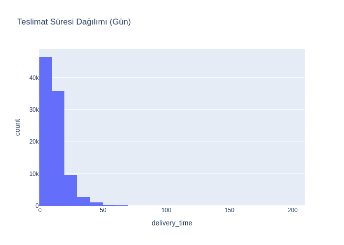

  

# 📦 Olist Brazilian E-Commerce Data Analysis
**Brazilian Online Retail – Data Cleaning, Exploratory Data Analysis, Customer Behavior Insights & A/B Testing**

---

## 🔍 Proje Hakkında
Brezilya'nın en büyük e-ticaret platformlarından **Olist** tarafından sağlanan veri seti kullanılarak:

- Sipariş akışı  
- Ürün & kategori yapısı  
- Müşteri lokasyonları  
- Teslimat süreleri  
- Ödeme davranışları  
- Müşteri memnuniyeti skorları  

analiz edilmiştir.

Bu çalışma, operasyonel süreçlerin anlaşılmasını ve müşteri davranışlarına yönelik **veri destekli içgörüler** üretilmesini amaçlar.

---

## 📊 Analiz Kapsamı

### **1️⃣ Veri Ön İşleme**
- Eksik verilerin incelenmesi ve temizlenmesi  
- Tarih kolonlarının `datetime` formatına dönüştürülmesi  
- Outlier tespiti  
- Yeni hesaplanmış metriklerin oluşturulması (örn. `delivery_time`)

---

## **📈 Görselleştirme Sonuçları**

### **🟦 Sipariş Toplam Fiyat Dağılımı**

---

### **🟪 En Çok Ürüne Sahip İlk 15 Kategori**

---

### **🟧 Ödeme Yöntemi Dağılımı**

---

### **🟩 Teslimat Süresi Dağılımı — Histogram**

---

### **🟩 Teslimat Süresi — Boxplot**

---

### **🟦 Müşteri Memnuniyet Skor Dağılımı**

---

### **🟨 Teslimat Hızı ve Müşteri Memnuniyeti**
*(Hızlı teslim vs yavaş teslim — T-test sonucu görselleştirilmiştir)*  

---

### **🟥 Kategori Bazında Sipariş Değerleri (ANOVA)**

---

### **🟫 Ödeme Yöntemine Göre Teslim Edilme Oranları (Chi-Square)**

---

## **📈 İstatistiksel Testler**

### **1️⃣ Teslimat Süresi → Memnuniyet (T-Testi)**
- p-değeri: **0.0000**
- **Anlamlı fark vardır.**
- Hızlı teslim alan müşteriler daha yüksek memnuniyet bildirir.

---

### **2️⃣ Ürün Kategorileri → Sipariş Değeri (ANOVA)**
- p-değeri: **0.0000**
- **Kategoriler arasında fiyat açısından anlamlı fark vardır.**

---

### **3️⃣ Ödeme Yöntemi → Siparişin Tamamlanması (Chi-Square)**
- p-değeri: **6.99e-36**
- **Bazı ödeme yöntemleri daha yüksek başarısızlık oranına sahiptir.**

---

## 📁 Kullanılan Veri Seti
Kaggle – **Brazilian E-Commerce Public Dataset by Olist**  
🔗 https://www.kaggle.com/datasets/olistbr/brazilian-ecommerce

---

## 🚀 Notebook
Notebook dosyası: **Olist_Veri_Analizi_Projesi.ipynb**  
Tüm veri temizleme, analiz ve görselleştirmeler adım adım anlatılmıştır.

---

## 🧠 Kazanımlar
Bu projede:

- Veri temizleme  
- Gerçek iş verisinde EDA  
- Plotly ile interaktif grafik üretimi  
- İstatistiksel hipotez testleri  
- Operasyonel metrik çıkarımı  
- Veri hikayeleştirme  

yetkinlikleri geliştirilmiştir.

---

## 📄 Lisans  
MIT Lisansı altında sunulmuştur.

---

## 🤝 İletişim  
Her türlü geri bildirim ve öneri için memnuniyetle dönüş yaparım!
